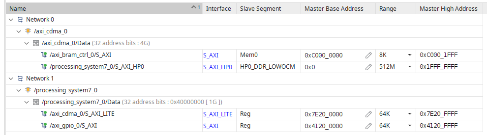
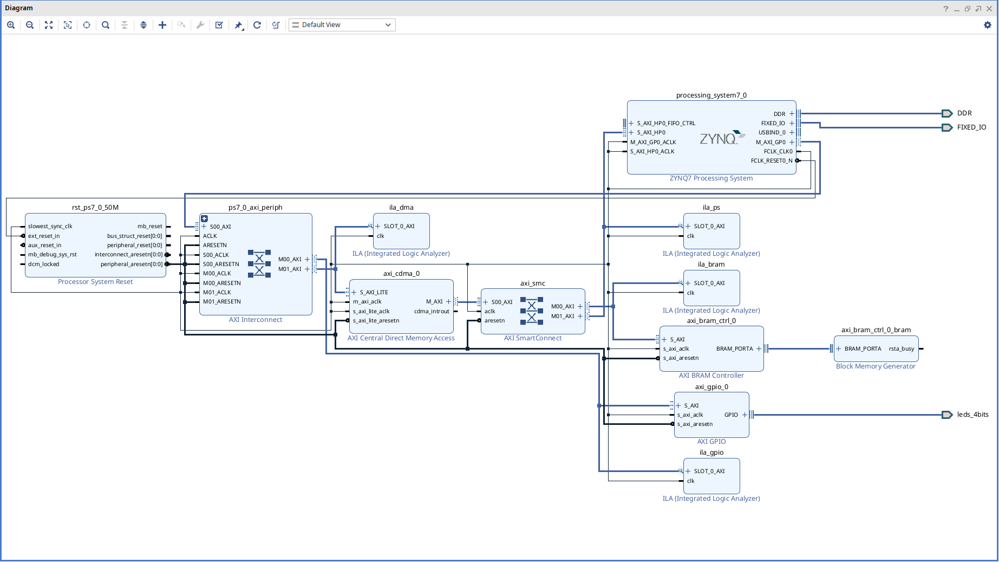

# zynq DMA user space

You need to modify the Zynq DTS file by replacing the DMA node with a UIO node.

## [devicetree](dts_example.dts)

```plaintext
	amba_pl {

        ...
        ...

		dma@7e200000 {
			#dma-cells = <0x01>;
			clock-names = "m_axi_aclk\0s_axi_lite_aclk";
			clocks = <0x01 0x0f 0x01 0x0f>;
			compatible = "generic-uio";                 # Change to UIO
			reg = <0x7e200000 0x10000>;
			xlnx,addrwidth = <0x20>;

			dma-channel@7e200000 {
				compatible = "xlnx,axi-cdma-channel";
				xlnx,datawidth = <0x20>;
				xlnx,device-id = <0x00>;
				xlnx,max-burst-len = <0x10>;
			};
		};

        ...
        ...

	};
```

This configuration allows user space to access the DMA memory region, enabling you to send commands and initiate transfers.

In addition, you need mapped physical and logical memory. To achieve this, create a memory node in the device tree with UIO support for the required size:

```plaintext
	uio_reserved_memory@a0000000 {
		compatible = "generic-uio";
		reg = <0x10000000 0x00100000>;      # <start_point size(bytes)> -> corresponds to BRAM_ADDR and MEM_SIZE in the software
		no-map;
		uio,device-name = "mem_reserved";
	};
```

## [Software](dma_example.c)

In your C code, define the key resource sizes and addresses as follows:

```plaintext
#define DMA_STATUS  0x4      /* R: Status (Ready/Busy) */
#define DMA_SA      0x18     /* R-W: Source address for the transaction */
#define DMA_DA      0x20     /* R-W: Destination address for the transaction */
#define DMA_BTT     0x28     /* R-W: Number of bytes to transfer */

#define DMA_SIZE    0x1000   // Size of the DMA AXI-Lite control port (as defined in the DTS and vivado)
#define MEM_SIZE    0x2000   // Size of the UIO reserved memory where the DMA will transfer data

#define PHYSICAL_DDR_ADDR   0x10000000  // Physical DDR address previously reserved in the DTS and mapped using UIO
#define BRAM_ADDR           0xC0000000  // Address provided by Vivado for the accelerator or desired hardware interface
```
This setup enables your application to configure and control DMA transactions from user space by mapping the corresponding memory regions.

## Addres Map Vivado



## [Block Design Vivado](vivado_bd.tcl)

